   # IMAGE STITCHING WITH OPENCV - C++

## 1. Summary

Sometimes we may have pieces of an image, how to make them a single image? Or when we take a panoramic image with our camera, how does this work? To answer these questions, first, we should understand the structure of an image. We also saw single pixel operations in the first homework, so we will deal with high-level image operations. In this homework, we will work with keypoints, features, and descriptors.

For this task, first, we need to understand what an Image Feature is and how we can use it. Image feature is a simple image pattern, based on which we can describe what we see on the image. For example, a cat's eye will be a feature on an image of a cat. The main role of features in computer vision (and not only) is to transform visual information into the vector space. This gives us the possibility to perform mathematical operations on them, for example finding a similar vector (which leads us to a similar image or object on the image).

Ok, but how to get this feature from the image? There are two ways of getting features from the image, first is an image descriptor (white box algorithms), second is a neural net (black box algorithms). Today we will be working with the first one. There are many algorithms for feature extraction, most popular of them are SURF, ORB, SIFT, BRIEF. Most of these algorithms are based on image gradient.[^1] 

## 2. Introduction

There are 15 datasets provided to us to work on. To work on those images OpenCV is a must-use, and C++ language is obligatory for us to use.

### 2.1. Requirements

- OpenCV + OpenCV Contrib 4.6
- ISO C++ Standard 17

### 2.2. Setting Up the Environment

After downloading the source codes of OpenCV and OpenCV Contrib and used CMake to build these libraries. Note that non-free and world options are to be activated after configuration. I used Microsoft Visual Studio Community 2022 (64-bit) – Current Version 17.2.3 with Nvidia 1050TI GPU and Intel 7700HQ CPU.

To use OpenCV, you need to edit your solution properties.

| Name of Properties                             | Path                                                                                                  |
|------------------------------------------------|-------------------------------------------------------------------------------------------------------|
| Configuration Properties/Debugging/Environment | opencv4\x64\vc17\bin;                                                                                 |
| C/C++/General/Additional Include Libraries     | opencv4\include;                                                                                      |
| C/C++/Language/C++ Language Standard           | ISO C++ 17 (/std:c++17)                                                                               |
| Linker/General/Additional Library Directories  | opencv4\x64\vc17\lib                                                                                  |
| Linker/Input/Additional Dependencies           | opencv_img_hash460.lib  opencv_img_hash460d.lib  opencv_world460.lib  opencv_world460.lib |

### 2.3. Setting Up the Project

After downloading the project, there must be 3 folders.

#### 2.3.1. InputImages

This folder is the main folder for our datasets and input images. It has 18 sub-folders. 15 of them are provided by the professor. These are:

- "T1", "T2", "T3", "RT1", "RT2", "RT3", "SRT1", "SRT2", "SRT3","NRT1", "NRT2", "NRT3", "LNSRT1", "LNSRT2", "LNSRT3"

Each letter corresponds to a transformation.

| Letter | Corresponding  Transformation |
|--------|-------------------------------|
| T      | Translation                   |
| R      | Rotation                      |
| S      | Scaling                       |
| N      | Noise                         |
| L      | Illumination Change           |

**Table I:** Correspondence Letters for Transformations.

3 folders are extra, and they are created by me. They all consist of an image named “Image.jpg”.

- "DEI", "MYHOUSE", "ISTANBUL"

Places and sources of these images are:

| Folder Name | Place                    | Source      |
|-------------|--------------------------|-------------|
| DEI         | 6 Via Giovanni Gradenigo | Google Maps |
| MYHOUSE     | 1 Via Riccardo Gigante   | Google Maps |
| ISTANBUL    | Eminonu-Istanbul         | Canva       |

**Table II:** Information about single Images to split as Panoramic Blocks.

#### 2.3.2. Libraries

This folder contains necessary libraries. All libraries have “.h” extension. Name of files are:

- cylinder.h
- divideImage.h
- findHomography.h
- findMatches.h
- frameSize.h
- imageTransformation.h
- parallel.h
- readImage.h
- stitch.h
#### 2.3.3. OutputImages

By default, this folder does not contain any sub-folders, but after running the program it will have folders with the same name as InputImages subfolders, which are shown in 1.3.1.

Next times of running the code cleans up these sub-folders and they are created back.

## 3. METHOD

In this kind of mosaic or panorama problems, we must compare images and find the common parts, then concatenate them each other. To do this, in the mean of finding common points, we will get help from features. Features are parts or patterns of an object in an image that help to identify it. For example, a square has 4 corners and 4 edges; they can be called features of the square, and they help us humans identify it’s a square. Features include properties like corners, edges, regions of interest points, ridges, etc.

We can basically list some feature detectors like this:

1. **Harris Corner Detection** — Uses a Gaussian window function to detect corners. 
2. **Shi-Tomasi Corner Detector** — The authors modified the scoring function used in Harris Corner Detection to achieve a better corner detection technique 
3. **Scale-Invariant Feature Transform (SIFT)** — This technique is scale invariant unlike the previous two. 
4. **Sped-Up Robust Features (SURF)** — This is a faster version of SIFT as the name says. 
5. **Features from Accelerated Segment Test (FAST)** — This is a much faster corner detection technique compared to SURF. 
6. **Binary Robust Independent Elementary Features (BRIEF)** — This is only a feature descriptor that can be used with any other feature detector. This technique reduces the memory usage by converting descriptors into binary strings. 
7. **Oriented FAST and Rotated BRIEF (ORB)** — SIFT and SURF are patented, and this algorithm from OpenCV labs is a free alternative to them, using FAST keypoint detector and BRIEF descriptor. 

In this homework, I will use the SIFT feature detector. Following are the major stages of computation used to generate the set of image features:

a. **Scale-space extrema detection:** The first stage of computation searches over all scales and image locations. It is implemented efficiently by using a difference-of-Gaussian function to identify potential interest points that are invariant to scale and orientation.

b. **Keypoint localization:** At each candidate location, a detailed model is fit to determine location and scale. Keypoints are selected based on measures of their stability.

c. **Orientation assignment:** One or more orientations are assigned to each keypoint location based on local image gradient directions. All future operations are performed on image data that has been transformed relative to the assigned orientation, scale, and location for each feature, thereby providing invariance to these transformations.

d. **Keypoint descriptor:** The local image gradients are measured at the selected scale in the region around each keypoint. These are transformed into a representation that allows for significant levels of local shape distortion and change in illumination 

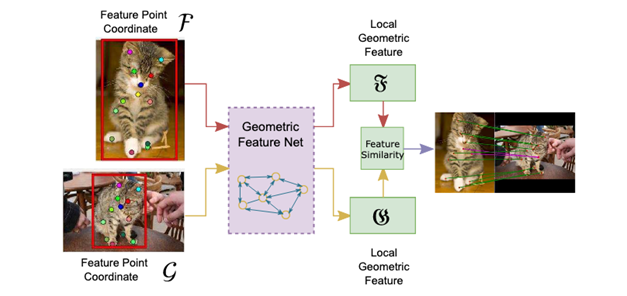  
**Figure I:** Schema for Feature Matching. source: [^9]

### 3.1. SIFT Flow Chart

  
**Figure II:** Flowchart of the SIFT. source: [^10]
### 3.2. Program Runtime

#### 3.2.1. Initializing the Program and Reading Image

First, we build the application in Visual Studio, then Debug and Analyze. The user is greeted with a starting question: Would you like to continue with RGB Image or Grayscale Image? 1 is more Grayscale and 2 is for RGB reading option. This input is stored in the `int answerForRGBorGray` variable and refuses & retakes the input if it is not 1 or 2.

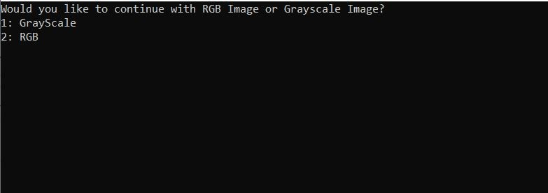  

**Figure III:** The meeting screen. It asks the color selection, in other meaning the channel number.

OpenCV `imread` function has `imreadModes`, which are modes for how to read images. It is an enumeration, shortly: \[^11\]

    enum cv::ImreadModes {
      cv::IMREAD_UNCHANGED = -1,
      cv::IMREAD_GRAYSCALE = 0,
      cv::IMREAD_COLOR = 1,
      cv::IMREAD_ANYDEPTH = 2,
      cv::IMREAD_ANYCOLOR = 4,
      cv::IMREAD_LOAD_GDAL = 8,
      cv::IMREAD_REDUCED_GRAYSCALE_2 = 16,
      cv::IMREAD_REDUCED_COLOR_2 = 17,
      cv::IMREAD_REDUCED_GRAYSCALE_4 = 32,
      cv::IMREAD_REDUCED_COLOR_4 = 33,
      cv::IMREAD_REDUCED_GRAYSCALE_8 = 64,
      cv::IMREAD_REDUCED_COLOR_8 = 65,
      cv::IMREAD_IGNORE_ORIENTATION = 128
    }
    

The program uses `(answerForRGBorGray – 1)` as `imreadMode` flag to get GRAYSCALE and COLOR modes in order. If the user chooses grayscale image type, then it will be returned to 3 channel images again, because of the cylindrical presentation. COLOR image is chosen to continue.

In the next question, the user chooses if they want to use a dataset provided by the professor (see 2.3.1.) or a horizontal image I prepared for.

  

**Figure IV:** Selection of a stock dataset or creating user's own dataset.

My house street and DEI building street images are taken from Google Maps. I also put an image from Istanbul. It takes the input to `int answerForDatasetOrImage` variable and refuses & retakes if not 1 or 2. If the first option is chosen:

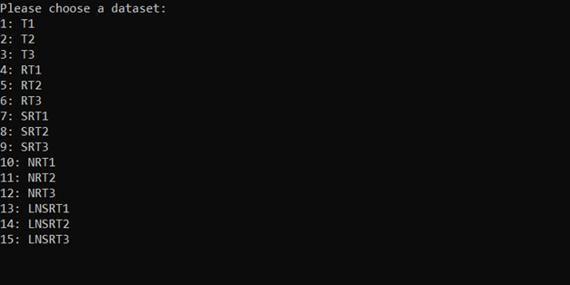  

**Figure V:** Selecting the Dataset

File names and their corresponding transformations are already discussed in the chapter 2.3.1. For this step, let us choose an average hardness dataset, for example 7: SRT1, string `subInputImageFolder` variable stores the name of selection.

    int readImage(std::string, std::vector&, int)
    

function reads all the images in the first parameter; “InputImages/SRT1” path and sets the `Mat` vector in the second parameter. 3rd parameter is reading grayscale or colorful. All the images are stored in `vector Images` variable.

If the second option is chosen:

  

**Figure VI:** Selection of a single image to split.

The user enters a number between 1 and 3. `int answerforWhichImagetoParse` variable holds the answer. And according to it, `string subInputImageFolder` variable stores the name of selection.

  

**Figure VII:** Selection of number of pieces of the panoramic image.

Since an image is chosen to split, now the user enters a number to decide the number of pieces to divide. Minimum number is 2, I set the maximum number as 6, because of the images are not that wide. The image will be divided as panoramic, not mosaic. When splitting, there is 50 pixels overlap between images.

    int divideImage(const cv::Mat& img, const int columnNumber, std::vector& blocks)
    

where `img` is the input image, `columnNumber` is the number of pieces and `blocks` are the vector of containing result blocks. To get an average calculation, 4 is chosen in this report.

  

**Figure VIII:** Selection of Transformation(s)

The user enters a string; the string is converted to uppercase and if the string contains R, N, or S or more of them, the transformation is applied according to their matches. Table I shows these letters and their corresponding operations. RSN input is entered in this example.

After this step, `subInputImageFolder`, which is the input file name, is checked under `OutputImages`. If the folder exists, then all resistant files inside are cleaned; if not exist then created

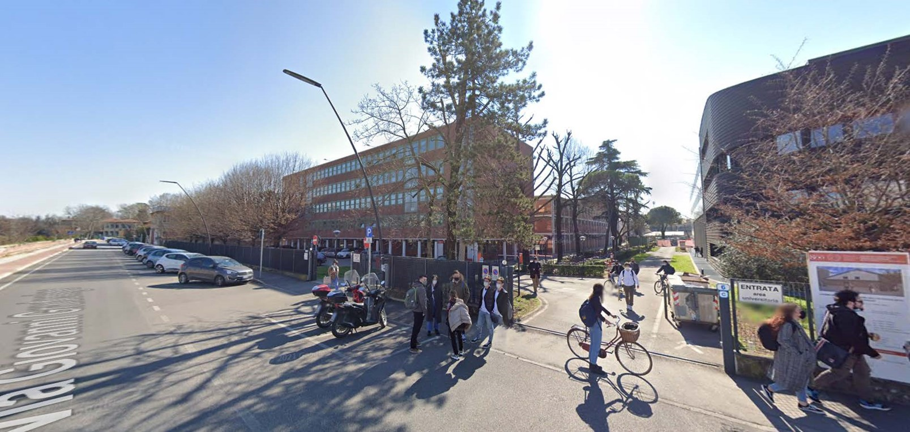  

**Figure IX:** Original image file. Taken from Google Maps and shows the UniPD DEI building

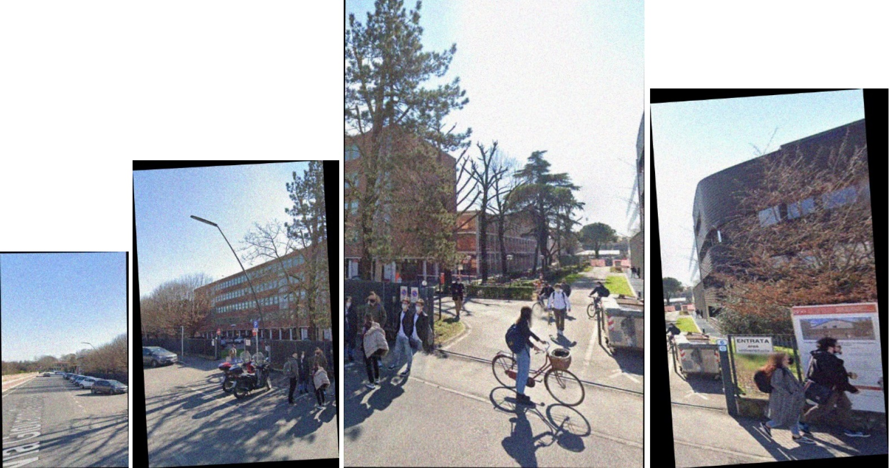  

**Figure X:** Randomly Resized, Rotated and Noised Blocks

I declared 2 functions for rotating. One is with cropping frame and the second one is without cropping.

    cv::Mat rotate(cv::Mat inputImage)
    

takes the image as input and rotates randomly between (-10, 10) degrees.

    cv::Mat rotateWithoutCropping(cv::Mat inputImage)
    

takes the image as input and rotates randomly between (-10, 10) degrees.

    cv::Mat scale(cv::Mat inputImage)
    

takes the image as input and resizes it randomly, between (0.5, 1.5) rate.

    cv::Mat AddGaussianNoise(cv::Mat inputImage)
    

takes the image as input and adds noise.

#### 3.2.2. Feature Detection and Matching

In this part, the program detects keypoints and features with SIFT, matches them with knnMatch. If the x point of distance is closer than the y point by ratio (0.75 in the program), then the match is saved as a good match.  
To track the keypoints and good matches, I used cv::drawMatches function and saved them as images. Here are steps of SR1 dataset:

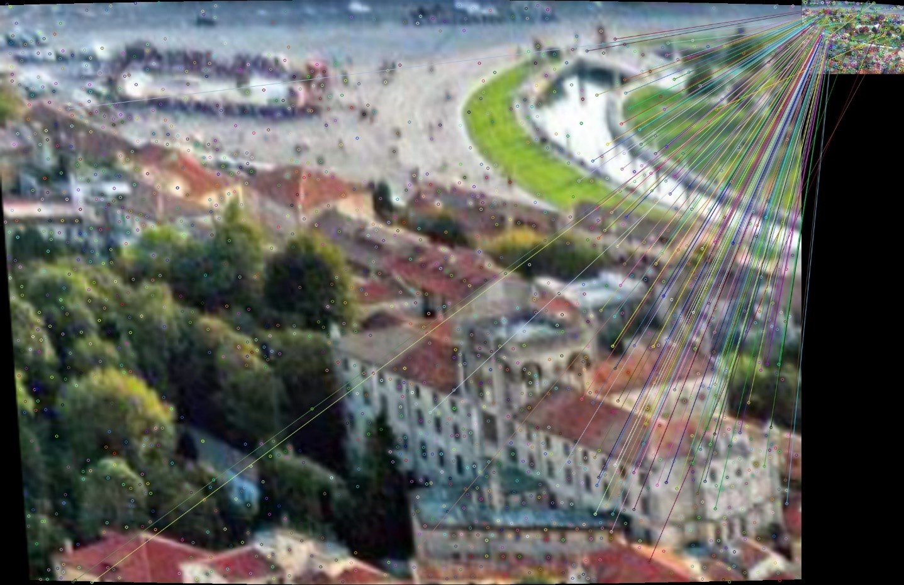  
***Figure XII:** Batches Between the Main Image and 2. Image*  

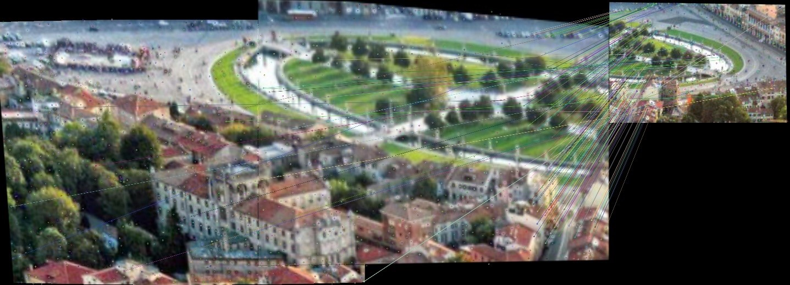  
***Figure XIII:** Batches Between the Main Image and 3. Image*  

 
***Figure XIV:** Batches Between the Main Image and 4. Image*  

 
***Figure XV:** Batches Between the Main Image and 5. Image*

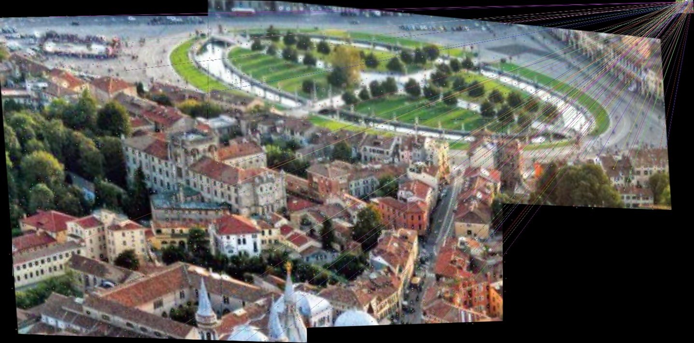    
***Figure XVI:** Batches Between the Main Image and 6. Image*  

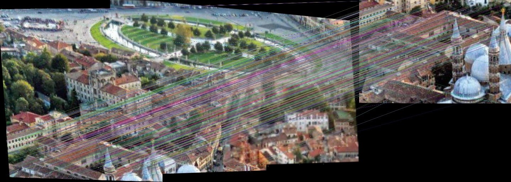    
***Figure XVII:** Batches Between the Main Image and 7. Image*  

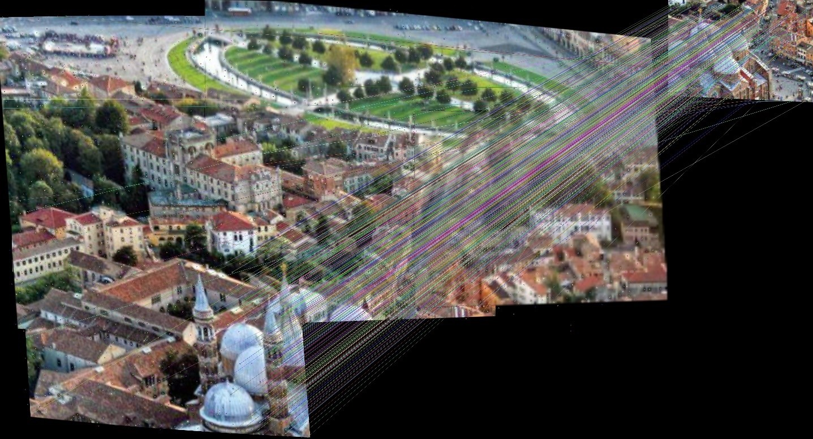    
***Figure XVIII:** Batches Between the Main Image and 8. Image*  

   
***Figure XIX:** Batches Between the Main Image and 9. Image*  

#### 3.2.3. Stitching and Projecting the Image

In case of stitching only 2 images together to create a panorama, we didn’t face any difficulty, and it was a straightforward process. But in case of stitching many images together, we see that as we stitch more and more images, images near to the side start getting distorted as shown.

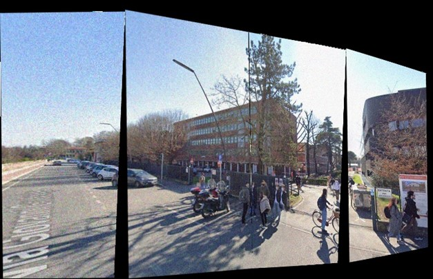  

***Figure XX:** Side image is distorted in a panoramic image stitching.*  

This distortion is happening only with 4 images(2nd image is also distorted), just wonder what will happen when we stitch 8 images for this panorama. The method explained involves the projection of the images onto a cylinder, unrolling them, and then stitching them together. However, depending on the input and required output, you can even project the images onto a sphere instead of a cylinder. I have in this project only projected the image onto the cylinder. 

## 4.	RESULTS
All dataset and images are calculated by this method and they all work fine. Some outputs are shown below:

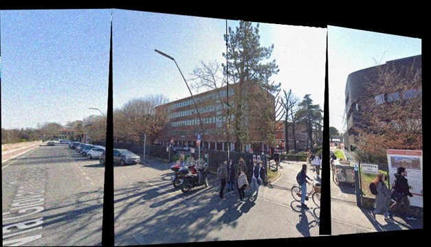   
***Figure XXIII:** The Result of DEI*  

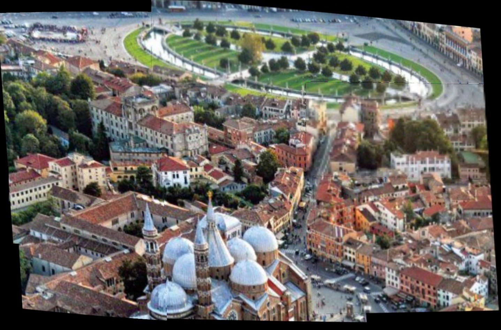   
***Figure XXIV:** The Result of SRT1*  

 
***Figure XXV:** The Result of RT2*   

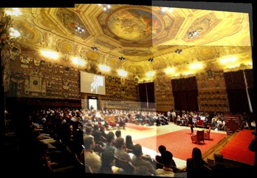  
***Figure XXVI:** The Result of LNSRT3*  

## 5.	CONCLUSION
This project aimed to understand image feature detection and feature matching problems. In the end of the project, I learned how to extract features and patching images.   
The datasets with number 2, which include Porta Portello are harder than 1 and 3. It is because they have lower number of matches.  
In future steps, I would like to add detector options like ORB etc. Thus, the user could choose what detector to use.

## 6.	SOURCES
[^1]: Feature extraction and similar image search with OpenCV for newbies | by Andrey Nikishaev | Machine Learning World | Medium  
[^2]: OpenCV: Harris Corner Detection  
[^3]: OpenCV: Shi-Tomasi Corner Detector & Good Features to Track  
[^4]: OpenCV: Introduction to SIFT (Scale-Invariant Feature Transform)  
[^5]: OpenCV: Introduction to SURF (Sped-Up Robust Features)  
[^6]: OpenCV: FAST Algorithm for Corner Detection  
[^7]: OpenCV: BRIEF (Binary Robust Independent Elementary Features)  
[^8]: OpenCV: ORB (Oriented FAST and Rotated BRIEF)  
[^9]: David G. Lowe, Distinctive Image Features from Scale-Invariant Keypoints, International Journal of Computer Vision, January 5, 2004  
[^10]: Raghu, K. An Approach to Parallelization of SIFT Algorithm on GPUs for Real-Time Applications,  Journal of Computer and Communications  
[^11]: OpenCV: Flags used for image file reading and writing  
